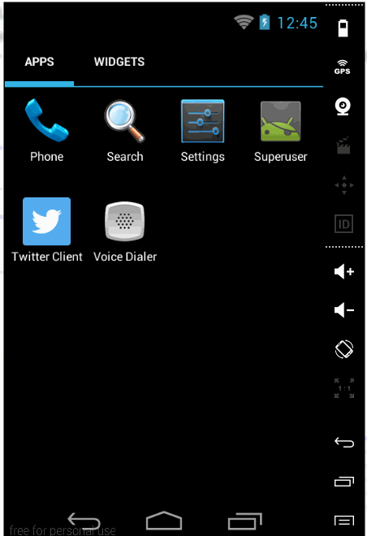

AndroidTwitterClient
====================

An Androdi Twitter client that supports viewing a Twitter timeline, compose tweets, and many more.

####Total time spent(week 2): 20 Hours

####User Stories:

   * [x] User can switch between Timeline, Mention and Tweets views using tabs.
     * User can view their home timeline tweets.
     * User can view the recent mentions of their username.
     * User can view their recent tweets.
     * User can scroll to bottom of either of these lists and new tweets will load ("infinite scroll")
   * [x] User can navigate to view their own profile
     * User can see picture, tagline, # of followers, # of following, and tweets on their profile.
     * User can click on the profile image in any tweet to see another user's profile.
     * User can see picture, tagline, # of followers, # of following, and tweets of clicked user.
     * Profile view should include that user's timeline and photos.
     * User can view following / followers list through the profile
   * [x] Display tweets in offline mode for home timeline, mentions and user tweets.

####Demo (Week 2):

####Demo Offline mode (Week 2):

####Total time spent(week 1): 16 Hours

####User Stories:

   * [x] User can sign in to Twitter using OAuth login
   * [x] User can view the tweets from their home timeline
     * User should be displayed the username, name, and body for each tweet
     * User should be displayed the relative timestamp for each tweet "8m", "7h"
     * User can view more tweets as they scroll with infinite pagination
     * Links in tweets are clickable and will launch the web browser (see autolink)
   * [x] User can click a “Compose” icon in the Action Bar on the top right
     * User can then enter a new tweet and post this to twitter
     * User is taken back to home timeline with new tweet visible in timeline
     * User can see a counter with total number of characters left for tweet
   * [x] User can refresh tweets timeline by pulling down to refresh
   * [x] Improve the user interface and theme the app to feel "twitter branded"
   * [x] Compose activity is replaced with a modal overlay
   * [x] User can tap a tweet to display a "detailed" view of that tweet
   * [x] User can select "reply" from detail view to respond to a tweet
   * [x] User can see embedded image media within the tweet detail view
   * [x] Display media image with TouchImageView and action bar overlay
   
Libraries used: android-async-http-1.4.3, ActiveAndroid-3.1, codepath-oauth-0.3.0.jar, codepath-utils.jar, scribe-codepath.jar, universal-image-loader-1.8.4.jar, picasso-2.3.4.jar and android-support-v4.

####Demo(Week 1):

